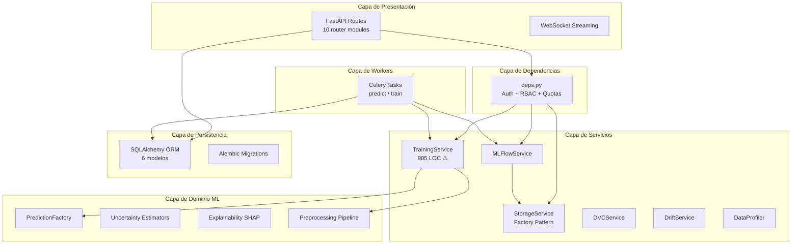
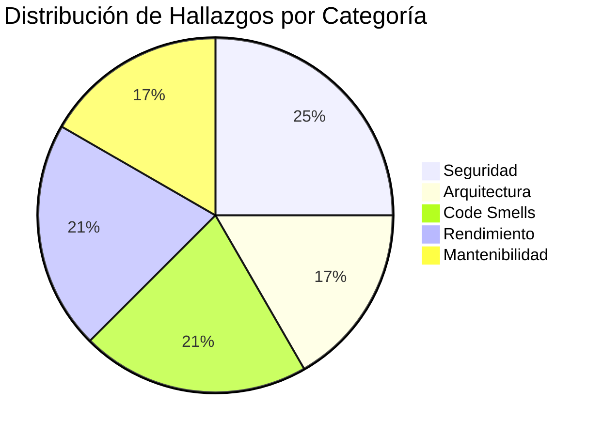

# 🔬 Auditoría Técnica 360° — PraxisML

> **Auditor:** Staff Engineer & Systems Auditor  
> **Fecha:** 2026-04-04  
> **Repositorio:** PraxisML — ML Engineering & AI Platform  
> **Backend:** ~9,800 LOC Python (FastAPI + Celery + SQLAlchemy)  
> **Frontend:** Next.js (React + TailwindCSS)  
> **Infra:** Docker Compose (9 servicios), GitHub Actions CI

---

## 1. 📐 Diagnóstico de Arquitectura

### 1.1 Patrón Identificado

La arquitectura es un **monolito modular por capas** con la siguiente estructura:



### 1.2 Fortalezas Arquitectónicas

| Aspecto | Evaluación |
|---------|------------|
| **Multi-tenancy** | ✅ Bien implementado: aislamiento por `tenant_id` en todos los modelos ORM, RBAC con 3 niveles |
| **Storage abstraction** | ✅ Interface Pattern con 3 backends (Local, MinIO, S3) — fácil migración a cloud |
| **Exception hierarchy** | ✅ Jerarquía de dominio bien estructurada con handler global en `main.py` |
| **Observabilidad** | ✅ Prometheus + Grafana + JSON logging estructurado |
| **ML Tracking** | ✅ MLflow integrado para experiment tracking y model registry |
| **Async processing** | ✅ Celery workers para tareas pesadas (training, batch inference) |

### 1.3 Problemas Arquitectónicos Detectados

> [!WARNING]
> #### Acoplamiento Excesivo en Capa de Rutas
> Los archivos de rutas contienen **lógica de negocio directa** en lugar de delegar a servicios. Ejemplos:
> - [models.py](file:///home/fyrthuz/Desktop/PraxisML/backend/app/api/routes/v1/models.py) — **790 LOC** con lógica de registro MLflow, descarga de artefactos y serialización inline
> - [datasets.py](file:///home/fyrthuz/Desktop/PraxisML/backend/app/api/routes/v1/datasets.py) — **573 LOC** con lógica DVC, parsing y storage inline
> - [streaming.py](file:///home/fyrthuz/Desktop/PraxisML/backend/app/api/routes/v1/streaming.py) — **434 LOC** con un endpoint WebSocket monolítico que carga modelos, gestiona background SHAP, y procesa inferencia

> [!IMPORTANT]
> #### God Object: `TrainingService` (905 LOC)
> Este archivo concentra **dos clases Trainer** (`SklearnTrainer` + `PyTorchTrainer`) con lógica duplicada de:
> - Feature preparation (`_prepare_features` — **idéntico** en ambas clases)
> - Holdout + Cross-validation para ambos frameworks
> - Guardado de modelos, logging MLflow, evaluación
> 
> Viola el **Single Responsibility Principle (SRP)** y el **Open/Closed Principle (OCP)**.

> [!NOTE]
> #### Falta de Capa de Servicio para Inferencia
> No existe un `InferenceService` dedicado. La lógica de inferencia está dispersa entre:
> - `predict.py` (Celery task) — carga modelo, aplica preprocesamiento, ejecuta estimador
> - `streaming.py` (WebSocket) — reimplementa la misma lógica con sutiles diferencias
> - `single_predict.py` (Celery task) — otra variante
> 
> Esto genera **duplicación** y **riesgo de divergencia** en el comportamiento de inferencia.

---

## 2. 🧹 Deuda Técnica y Code Smells

### 2.1 Complejidad Ciclomática Elevada

| Archivo | LOC | Funciones | Problema |
|---------|-----|-----------|----------|
| [training_service.py](file:///home/fyrthuz/Desktop/PraxisML/backend/app/services/training_service.py) | 905 | 16 | God Object — dos trainers con lógica duplicada |
| [models.py](file:///home/fyrthuz/Desktop/PraxisML/backend/app/api/routes/v1/models.py) | 790 | 16 | Lógica de negocio inline en rutas |
| [datasets.py](file:///home/fyrthuz/Desktop/PraxisML/backend/app/api/routes/v1/datasets.py) | 573 | 10 | Parsing + storage + DVC en un solo archivo |
| [streaming.py](file:///home/fyrthuz/Desktop/PraxisML/backend/app/api/routes/v1/streaming.py) | 434 | 3 | Un solo endpoint de 200+ LOC, `process_row_real` con SHAP unpacking de 50+ LOC |
| [drift.py](file:///home/fyrthuz/Desktop/PraxisML/backend/app/api/routes/v1/drift.py) | 518 | — | Cálculos estadísticos inline en rutas |

### 2.2 Violaciones de Principios SOLID

| Principio | Violación | Ubicación |
|-----------|-----------|-----------|
| **SRP** | `_prepare_features()` **duplicado** idénticamente en `SklearnTrainer` y `PyTorchTrainer` | [training_service.py:319-327](file:///home/fyrthuz/Desktop/PraxisML/backend/app/services/training_service.py#L319-L327) vs [training_service.py:842-850](file:///home/fyrthuz/Desktop/PraxisML/backend/app/services/training_service.py#L842-L850) |
| **SRP** | `PredictionFactory.get_estimator()` define **clases anónimas inline** (`NoUncertaintyEstimator`, `NoUncertaintySklearn`) dentro de un método de 120+ LOC | [factory.py:136-173](file:///home/fyrthuz/Desktop/PraxisML/backend/app/core_ml/factory.py#L136-L173) |
| **OCP** | Nuevo tipo de modelo requiere modificar `_get_model()` directamente | [training_service.py:421-455](file:///home/fyrthuz/Desktop/PraxisML/backend/app/services/training_service.py#L421-L455) |
| **DIP** | `StorageService` factory usa `os.getenv()` directamente en vez de inyectar `settings` | [storage_service.py:65](file:///home/fyrthuz/Desktop/PraxisML/backend/app/services/storage_service.py#L65) |
| **DIP** | `MinIOStorageService.__init__` lee credenciales directamente de `os.getenv()` en lugar de recibirlas por inyección | [storage_minio.py:34-38](file:///home/fyrthuz/Desktop/PraxisML/backend/app/services/storage_minio.py#L34-L38) |
| **ISP** | `IUncertaintyAlgorithm` interface es demasiado genérica — sklearn y pytorch estimators tienen contratos muy diferentes | [interfaces.py](file:///home/fyrthuz/Desktop/PraxisML/backend/app/core_ml/interfaces.py) |

### 2.3 `print()` Statements en Producción

Se encontraron **14 sentencias `print()`** en código de producción que deberían usar el `logger` estructurado:

| Archivo | Occurrencias | Impacto |
|---------|-------------|---------|
| [security.py](file:///home/fyrthuz/Desktop/PraxisML/backend/app/core/security.py) | 3 | 🔴 **Crítico** — errores de autenticación se pierden del pipeline de logging |
| [models.py (routes)](file:///home/fyrthuz/Desktop/PraxisML/backend/app/api/routes/v1/models.py) | 8 | 🟡 Warnings de MLflow no rastreables |
| [predict.py (task)](file:///home/fyrthuz/Desktop/PraxisML/backend/app/worker/tasks/predict.py) | 1 | 🟡 Info de run MLflow pierde contexto |
| [setup.py](file:///home/fyrthuz/Desktop/PraxisML/backend/app/core/setup.py) | 1 | 🟢 Menor |

### 2.4 Uso Deprecado de `datetime.utcnow()`

Se utiliza `datetime.utcnow()` en **10+ archivos** (modelos ORM, deps, security). Desde Python 3.12 es deprecado. Debe usar `datetime.now(timezone.utc)`.

Archivos afectados: `user.py`, `tenant.py`, `dataset.py`, `prediction.py`, `ml_model.py`, `deps.py`, `security.py`, `predict.py (task)`, `models.py (routes)`.

### 2.5 Dependencias Redundantes / Conflicto

En [pyproject.toml](file:///home/fyrthuz/Desktop/PraxisML/backend/pyproject.toml):

| Problema | Detalle |
|----------|---------|
| **Duplicación** de `[project.optional-dependencies].dev` y `[dependency-groups].dev` | Versiones divergen (e.g., `pytest>=8.0` vs `pytest>=9.0`) |
| **Conflicto JWT** | `python-jose[cryptography]`, `pyjwt`, y `jose` — tres librerías JWT simultáneas |
| `bcrypt==4.0.1` **pinned** | Versión hardcoded mientras `passlib[bcrypt]` resuelve su propia versión |
| **Archivo muerto** | `test_integration.db` (114KB SQLite) commiteado en el repo |
| **Artefactos ML** | `mnist_model.pth` (440KB) commiteado en raíz — debería estar en DVC/Artifacts |

### 2.6 Código Muerto / No Utilizado

| Archivo | Observación |
|---------|-------------|
| [cleanup.py](file:///home/fyrthuz/Desktop/PraxisML/cleanup.py) | Script raíz sin contexto de uso |
| [generate_dummy_unet.py](file:///home/fyrthuz/Desktop/PraxisML/backend/generate_dummy_unet.py) | Archivo de desarrollo no limpiado |
| [verify_model_loading.py](file:///home/fyrthuz/Desktop/PraxisML/backend/verify_model_loading.py) | Debug script en directorio principal |
| [package.json (raíz)](file:///home/fyrthuz/Desktop/PraxisML/package.json) | `node_modules` instalados en raíz (53B package.json + 17KB lock) |
| `backend/main.py` | Wrapper innecesario (85B) — el punto de entrada real es `app/main.py` |

---

## 3. 🚀 Escalabilidad y Rendimiento

### 3.1 Consultas de Base de Datos

> [!WARNING]
> #### Falta Paginación en Endpoints de Listado
> Los endpoints `GET /predictions`, `GET /datasets/`, `GET /models/` retornan **TODOS** los registros sin paginación:
> ```python
> # predictions.py:284-290
> predictions = db.query(Prediction)
>     .filter(Prediction.tenant_id == tenant.id)
>     .order_by(Prediction.created_at.desc())
>     .all()  # ⚠️ Sin limit/offset
> ```
> Con un tenant que acumule miles de predicciones, esto causa **timeouts y OOM**.

> [!NOTE]
> #### Quota Checks — Consultas Repetidas
> Cada endpoint protegido por quotas ejecuta **3 queries independientes** en cascada:
> 1. `get_current_user` → `SELECT * FROM users WHERE id = ?`
> 2. `get_current_tenant` → `SELECT * FROM tenant WHERE id = ?`
> 3. `check_X_quota` → `SELECT COUNT(*) FROM X WHERE tenant_id = ?`
> 
> Podrían consolidarse en una sola query con JOIN.

### 3.2 Carga de Modelos en WebSocket

En [streaming.py](file:///home/fyrthuz/Desktop/PraxisML/backend/app/api/routes/v1/streaming.py#L110-L127), cada conexión WebSocket carga el modelo desde cero:

```python
# Línea ~111-126 — Se ejecuta POR CADA conexión WS
model = torch.jit.load(torchscript_path, map_location=device)
# o
model = mlflow_svc.load_model(mlflow_run_id, device=device)
```

No hay **model cache** compartido entre conexiones. Si 10 usuarios se conectan al mismo modelo, se cargan 10 copias idénticas en memoria.

**Impacto:** RAM × N-conexiones. Un modelo de 500MB con 10 conexiones = **5GB desperdiciados**.

### 3.3 Background SHAP — Recarga por Conexión

El background dataset para SHAP se descarga desde storage en **cada conexión** WebSocket:
```python
# streaming.py:162-163
background_data = await _load_background_data(db, metadata, ...)
```
No se cachea entre conexiones ni solicitudes del mismo modelo.

### 3.4 Celery Worker — Pool Solo

```python
# docker-compose.yml:151
command: ["celery", "-A", "...", "--pool=solo"]
```

El worker Celery usa `--pool=solo`, que ejecuta **una tarea a la vez** en un solo thread. Para un sistema multi-tenant con entrenamiento + inferencia, esto crea un cuello de botella severo.

### 3.5 Engine de Base de Datos — Sin Connection Pool Tuning

```python
# database.py:5-9
engine = create_engine(
    settings.DATABASE_URL,
    pool_pre_ping=True,
    # Sin pool_size, max_overflow, pool_timeout
)
```

Se usan los defaults de SQLAlchemy (`pool_size=5`, `max_overflow=10`). Para una plataforma multi-tenant con workers, esto es insuficiente.

---

## 4. 🔒 Seguridad y Robustez

### 4.1 Vulnerabilidades Críticas (OWASP Top 10)

#### A08:2021 — Deserialización Insegura 🔴

```python
# mlflow_service.py:120-122
checkpoint = torch.load(
    file_to_load, map_location=device, weights_only=False  # ⚠️
)
```

`torch.load(weights_only=False)` usa **pickle** internamente, lo que permite **Remote Code Execution (RCE)** si un atacante sube un archivo `.pth` malicioso con un tenant comprometido.

**Riesgo:** Un usuario con rol `editor` puede ejecutar código arbitrario en el servidor al subir un modelo.

#### A01:2021 — Broken Access Control 🔴

```python
# streaming.py:24-29
@router.websocket("/streaming/predict/{model_id}")
async def websocket_predict(
    token: str = Query(...),  # ⚠️ Token JWT en query parameter
)
```

El JWT se transmite como **query parameter** de la URL. Esto:
1. Se registra en logs de servidores proxy/nginx
2. Queda en el historial del navegador
3. Visible en métricas de Prometheus (`request_url` label)

#### A05:2021 — Security Misconfiguration 🟡

```python
# main.py:119-125
cors_origins = [
    "http://localhost:3000",
    "http://127.0.0.1:3000",
    "*",  # ⚠️ Wildcard + allow_credentials=True
]
```

`allow_origins=["*"]` **con** `allow_credentials=True` es una combinación peligrosa que los navegadores modernos rechazan, pero puede causar problemas con proxies o clientes custom.

#### A03:2021 — Injection (Command Injection) 🟡

```python
# dvc_service.py:39-46
result = subprocess.run(
    cmd,
    cwd=str(working_dir),
    capture_output=True,
    text=True,
    check=True,
)
```

Si el `registry_name` o `tenant_id` proviene directamente del input del usuario sin sanitización, podría inyectar comandos en los argumentos `dvc add`, `dvc push`, etc. Los valores se construyen desde el tenant (no directamente del usuario), pero no hay validación explícita.

#### A07:2021 — Cross-Site Scripting (XSS, indirecto) 🟡

```python
# main.py:184
"detail": str(exc) if settings.ENVIRONMENT == "development" else None,
```

En desarrollo, los stacktraces se exponen directamente al cliente. Si alguna excepción contiene input del usuario no sanitizado, podría explotarse.

### 4.2 Verify Audience/Issuer en JWT External 🟡

```python
# security.py:78-83
payload = jwt.decode(
    token, rsa_key,
    algorithms=["RS256"],
    options={"verify_aud": False, "verify_iss": False}  # ⚠️
)
```

Se salta la verificación de audience e issuer para tokens externos (Auth0/Clerk). Esto permite que un JWT emitido para **otra aplicación** sea aceptado como válido.

### 4.3 Manejo de Errores — Sistema "Silencioso"

| Problema | Ubicación | Impacto |
|----------|-----------|---------|
| `print()` en `security.py` para errores JWT | [security.py:28,86,97](file:///home/fyrthuz/Desktop/PraxisML/backend/app/core/security.py#L28) | Los intentos de autenticación fallidos no generan alertas en el pipeline de monitorización |
| `except Exception: pass` en predict task | [predict.py:217](file:///home/fyrthuz/Desktop/PraxisML/backend/app/worker/tasks/predict.py#L217) | Fallo al actualizar BD se silencia completamente |
| SHAP fallback silencioso | [streaming.py:423-427](file:///home/fyrthuz/Desktop/PraxisML/backend/app/api/routes/v1/streaming.py#L423) | Error en SHAP devuelve `[]` sin rastro para el usuario |
| MLflow exceptions silenciadas | [mlflow_service.py:451](file:///home/fyrthuz/Desktop/PraxisML/backend/app/services/mlflow_service.py#L451) | `delete_registered_model` devuelve `False` sin contexto |
| `get_run_details` vacía errores | [mlflow_service.py:389-392](file:///home/fyrthuz/Desktop/PraxisML/backend/app/services/mlflow_service.py#L389) | Retorna `{}` genérico sin exponer motivo al caller |

### 4.4 Credenciales Hardcoded en Docker Compose

```yaml
# docker-compose.yml
POSTGRES_USER: postgres
POSTGRES_PASSWORD: postgres
MINIO_ROOT_USER: minioadmin
MINIO_ROOT_PASSWORD: minioadmin
GF_SECURITY_ADMIN_PASSWORD: admin
```

Aunque es configuración de desarrollo, no hay `.env` override explícito ni documentación de producción para cambiar credenciales de infraestructura.

---

## 5. 📊 Métricas Adicionales de Calidad

### 5.1 Cobertura de Tests

| Suite | Archivos | Cobertura Target |
|-------|----------|-----------------|
| Unit tests | 4 archivos | `--cov-fail-under=30` ⚠️ |
| Integration tests | 2 archivos | Sin threshold |

> [!CAUTION]
> El umbral de cobertura es **30%** — extremadamente bajo para una plataforma de producción. Áreas críticas **sin tests**:
> - `streaming.py` (WebSocket inference)
> - `training_service.py` (905 LOC sin unit tests directos)
> - `mlflow_service.py` (loading/registry)
> - `dvc_service.py` (data versioning)
> - `storage_minio.py` / `storage_s3.py`
> - `explainability.py` (SHAP)

### 5.2 Lint Configuration

```yaml
# ci.yml:103
ruff check app/ --select=E,F,W --ignore=E501
```

Solo se verifican errores básicos (E=pycodestyle, F=pyflakes, W=warnings). **No se verifican:**
- `I` — import sorting
- `N` — naming conventions
- `S` — bandit security checks
- `C` — complexity checks
- `B` — bugbear (common anti-patterns)

---

## 6. 🗺️ Roadmap de Mejora

### Tabla Priorizada: Impacto vs Esfuerzo

| # | Mejora Sugerida | Prioridad | Esfuerzo | Beneficio Técnico |
|---|----------------|-----------|----------|-------------------|
| 1 | **Eliminar `torch.load(weights_only=False)`** — Usar `weights_only=True` + safetensors o validar hashes antes de deserializar | 🔴 **Crítica** | Bajo | Elimina vector de RCE (Remote Code Execution) |
| 2 | **Reemplazar `print()` por `logger`** en security.py, models.py, predict.py | 🔴 **Crítica** | Bajo | Los errores de auth entran en el pipeline de alertas Prometheus/Grafana |
| 3 | **Verificar `aud` e `iss` en JWT externo** (Auth0/Clerk) — `verify_aud=True, verify_iss=True` + configurar audience | 🔴 **Crítica** | Bajo | Previene token reuse cross-application |
| 4 | **Model Cache para WebSocket** — Singleton `Dict[model_id, model]` con TTL y LRU eviction | 🟠 Alta | Medio | Reduce RAM ~80% para N conexiones al mismo modelo |
| 5 | **Extraer `InferenceService`** — Consolidar `predict.py`, `single_predict.py`, `streaming.py` en un único servicio | 🟠 Alta | Alto | Elimina 3 implementaciones duplicadas de inferencia, reduce bugs |
| 6 | **Add paginación** (`limit/offset` o cursor) a `GET /predictions`, `GET /datasets`, `GET /models` | 🟠 Alta | Bajo | Previene OOM con tenants con miles de registros |
| 7 | **Refactorizar `TrainingService`** — Extraer `_prepare_features` a utility, usar Strategy pattern para sklearn/pytorch | 🟡 Media | Medio | Elimina duplicación, facilita agregar nuevos frameworks |
| 8 | **Sanitizar credenciales de Docker Compose** — Variables de infraestructura desde `.env` o Docker secrets | 🟡 Media | Bajo | Evita fuga de credenciales por defecto en staging/production |
| 9 | **Eliminar token JWT del query param en WebSocket** — Usar subprotocol o primera autenticación vía mensaje | 🟡 Media | Medio | El JWT deja de aparecer en logs de proxy y métricas |
| 10 | **Reemplazar `datetime.utcnow()`** por `datetime.now(timezone.utc)` en 10+ archivos | 🟡 Media | Bajo | Elimina DeprecationWarning de Python 3.12+ |
| 11 | **Consolidar dependencias JWT** — Elegir `python-jose` O `pyjwt`, eliminar las otras | 🟡 Media | Bajo | Reduce superficie de ataque y conflictos de dependencias |
| 12 | **Subir cobertura de tests a 60%** — Añadir tests para `TrainingService`, `streaming`, `mlflow_service` | 🟡 Media | Alto | Permite refactorizaciones seguras |
| 13 | **Ampliar reglas de Ruff** — Añadir `S` (security), `B` (bugbear), `C` (complexity), `I` (imports) | 🟢 Baja | Bajo | Detecta code smells automáticamente en CI |
| 14 | **Tune DB connection pool** — Configurar `pool_size=20, max_overflow=30` según concurrencia esperada | 🟢 Baja | Bajo | Evita `QueuePool limit exceeded` bajo carga |
| 15 | **Eliminar archivos muertos** — `cleanup.py`, `generate_dummy_unet.py`, `verify_model_loading.py`, `mnist_model.pth`, `test_integration.db` | 🟢 Baja | Bajo | Limpieza de repositorio |
| 16 | **Cambiar Celery pool a `prefork` o `eventlet`** — Evaluar `--concurrency=2` para permitir paralelismo limitado | 🟢 Baja | Medio | Permite 2+ tareas simultáneas (un training + un inference) |
| 17 | **Cachear background SHAP** — Cargar una vez por modelo y reutilizar entre conexiones/requests | 🟢 Baja | Bajo | Reduce latencia de SHAP ~90% en streaming |
| 18 | **Limpear `pyproject.toml`** — Eliminar la sección `[dependency-groups]` duplicada, unificar en `[project.optional-dependencies]` | 🟢 Baja | Bajo | Evita confusión en resolución de dependencias |

---

## Resumen Ejecutivo



### Veredicto General

PraxisML demuestra una **sólida visión arquitectónica** con decisiones inteligentes (multi-tenancy, storage abstraction, MLflow tracking, RBAC). Sin embargo, la acumulación de deuda técnica en tres áreas requiere atención inmediata:

1. **Seguridad**: La deserialización insegura con `torch.load(weights_only=False)` es la vulnerabilidad más crítica. Los `print()` en el módulo de seguridad marginan los errores de autenticación del pipeline de observabilidad.

2. **Escalabilidad**: La falta de model caching en WebSocket y la ausencia de paginación son bombas de tiempo que explotarán con el crecimiento de usuarios.

3. **Mantenibilidad**: El `TrainingService` de 905 LOC y los endpoints de rutas que contienen lógica de negocio hacen que el código sea frágil y difícil de extender.

> [!TIP]
> **Quick Wins (< 1 día de trabajo):** Items #1, #2, #3, #6, #10, #11, #13, #15, #18 pueden ejecutarse en paralelo y representan la mayor mejora incremental con el mínimo esfuerzo.
