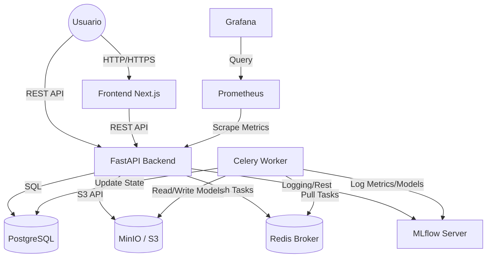

# Arquitectura de PraxisML

PraxisML es una plataforma diseñada siguiendo una arquitectura de microservicios, orientada a eventos para el procesamiento pesado, y diseñada bajo estrictos estándares de seguridad y multi-tenancy.

## 1. Diagrama de Contexto del Sistema

## 2. Componentes Principales

### 2.1. API Gateway / Frontend (Next.js)
El frontend actúa como el cliente principal para los usuarios finales. Construido con **Next.js 16**, consume la API REST de FastAPI. Gestiona la autenticación persistiendo el JWT en cliente y renderiza vistas en tiempo real (polling o revalidación) para el estado de los modelos y predicciones.

### 2.2. Core Backend (FastAPI)
El corazón transaccional del sistema.
- **Responsabilidades**: Autenticación, autorización (RBAC), control de cuotas, validación de schemas de entrada, gestión de metadatos en base de datos.
- **Sincronía**: Es estrictamente síncrono para operaciones CRUD, pero delega el procesamiento ML a Celery.

### 2.3. Motor de Tareas Asíncronas (Celery + Redis)
El procesamiento de Machine Learning (entrenamiento, preprocesamiento pesado e inferencia) nunca ocurre en el hilo de la solicitud HTTP.
- **Broker**: `Redis` recibe los mensajes de trabajo.
- **Result Backend**: `Redis` almacena temporalmente los estados de salida (`PENDING`, `STARTED`, `SUCCESS`, `FAILURE`).
- **Workers**: Procesos independientes que cargan dinámicamente modelos TorchScript o Scikit-learn desde disco/MLflow y ejecutan la matemática pesada.

### 2.4. Experiment Tracking (MLflow)
Servicio independiente dedicado exclusivamente al ciclo de vida del modelo de Machine Learning.
- **Database**: Usa una tabla dedicada dentro del clúster de PostgreSQL (`mlflow_db`).
- **Artifact Store**: Delega el almacenamiento de binarios (`.pt`, `.pkl`, `.npy`) a MinIO o AWS S3.

### 2.5. Capa de Datos Persistente
- **Relacional (PostgreSQL)**: Almacena Tenants, Usuarios, metadatos de Datasets, referencias a Modelos y registros de Predicciones.
- **Object Storage (MinIO / S3)**: Almacén inmutable para grandes volúmenes de datos binarios (ZIPs de datasets, blobs de imágenes médicas, pesos neuronales).

### 2.6. Observabilidad (Prometheus + Grafana)
FastAPI expone un endpoint `/metrics` en formato Prometheus mediante la librería `prometheus-fastapi-instrumentator`.
- **Prometheus** hace *scraping* cada X segundos.
- **Grafana** visualiza latencias, throughput (RPS), códigos de error 4xx/5xx y consumo de recursos.

## 3. Modelo Multi-Tenant

PraxisML aísla lógicamente la información de múltiples clientes u organizaciones compartiendo la misma infraestructura (Shared Compute, Isolated Data).

1. Todo usuario pertenece a un `Tenant`.
2. Las peticiones a la API inyectan `user.tenant_id` en el contexto.
3. Las queries a base de datos aplican forzosamente `.filter(Model.tenant_id == user.tenant_id)`.
4. El almacenamiento de objetos usa rutas estructuradas: `tenants/{tenant_id}/datasets/{dataset_id}` asegurando el aislamiento en repositorios de blobs compartidos.
