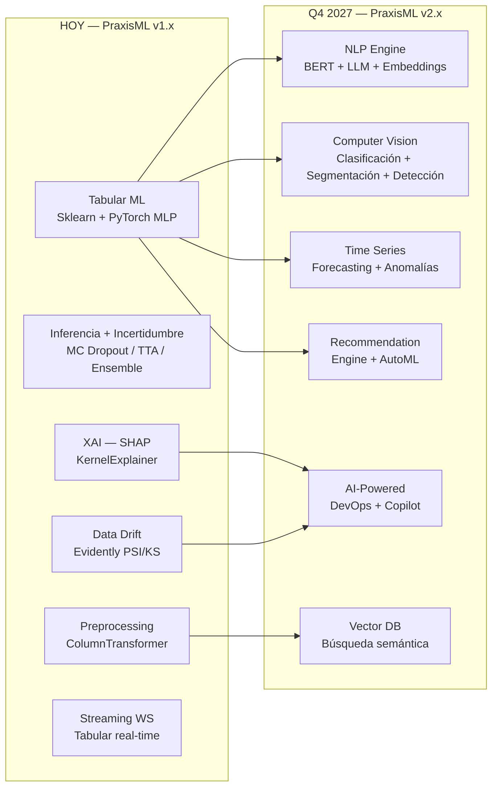
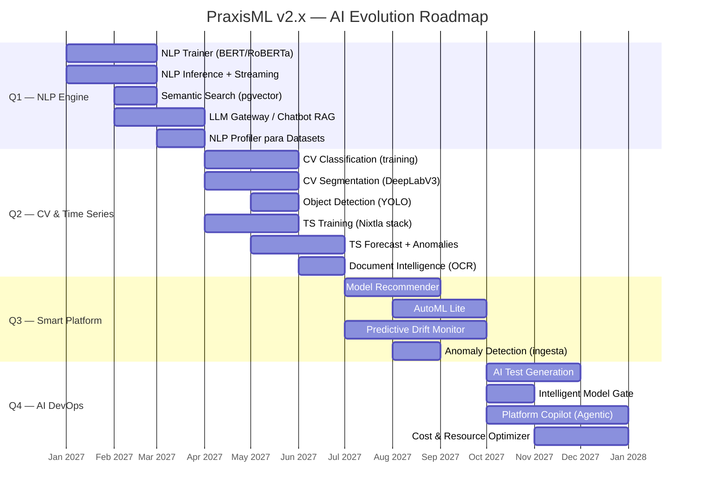

# 🗺️ Roadmap de Evolución Tecnológica — PraxisML
# IA & Innovación (Q1 2027 → Q4 2027)

> **Autor:** CTO & AI Solutions Architect  
> **Fecha:** 2026-04-04  
> **Base:** Análisis exhaustivo del repositorio PraxisML (~9,800 LOC backend, Next.js frontend, 9 servicios Docker)  
> **Arquitectura actual:** FastAPI monolito modular + Celery workers + MLflow + PostgreSQL + MinIO + Redis + Prometheus/Grafana

---

## 📊 Mapa de Capacidades Actuales vs Futuras



## 🏗️ Arquitectura de Rutas por Dominio

La evolución reorganiza los endpoints actuales (`/api/v1/*`) en **dominios verticales**, cada uno con su propio router, trainer y servicio de inferencia:

```mermaid
graph TB
    subgraph "main.py — Router Registration"
        R[FastAPI App]
    end
    subgraph "/api/v1/tabular — HOY"
        T1[training.py]
        T2[predictions.py]
        T3[preprocessing.py]
        T4[streaming.py]
    end
    subgraph "/api/v1/nlp — Q1"
        N1[nlp/training.py]
        N2[nlp/inference.py]
        N3[nlp/embeddings.py]
        N4[nlp/assistant.py]
    end
    subgraph "/api/v1/cv — Q2"
        C1[cv/training.py]
        C2[cv/inference.py]
        C3[cv/segmentation.py]
        C4[cv/detection.py]
    end
    subgraph "/api/v1/timeseries — Q2"
        TS1[timeseries/training.py]
        TS2[timeseries/forecast.py]
        TS3[timeseries/anomalies.py]
    end
    R --> T1 & T2 & T3 & T4
    R --> N1 & N2 & N3 & N4
    R --> C1 & C2 & C3 & C4
    R --> TS1 & TS2 & TS3
```



**Impacto en `main.py`:**
```python
# Registro de routers por dominio vertical
# --- Tabular (existente, se renombra prefijo) ---
app.include_router(training.router, prefix=f"{API}/tabular", tags=["Tabular"])
app.include_router(predictions.router, prefix=f"{API}/tabular", tags=["Tabular"])

# --- NLP (Q1) ---
app.include_router(nlp_training.router, prefix=f"{API}/nlp", tags=["NLP"])
app.include_router(nlp_inference.router, prefix=f"{API}/nlp", tags=["NLP"])
app.include_router(assistant.router, prefix=f"{API}/nlp", tags=["NLP"])

# --- Computer Vision (Q2) ---
app.include_router(cv_training.router, prefix=f"{API}/cv", tags=["Computer Vision"])
app.include_router(cv_inference.router, prefix=f"{API}/cv", tags=["Computer Vision"])

# --- Time Series (Q2) ---
app.include_router(ts_training.router, prefix=f"{API}/timeseries", tags=["Time Series"])
app.include_router(ts_forecast.router, prefix=f"{API}/timeseries", tags=["Time Series"])
```

> [!NOTE]
> Los endpoints existentes (`/api/v1/training/*`, `/api/v1/predictions/*`) se mantienen como alias de compatibilidad apuntando a `/api/v1/tabular/*` para no romper clientes existentes.

---

## Fase 1 — Q1 2027: NLP Engine (Clásico + Generativo)

### 🎯 Objetivo

Introducir NLP como vertical completa de la plataforma, con **dos ejes diferenciados**:

- **NLP Clásico (BERT / Transformers fine-tuned):** Clasificación de texto, NER, análisis de sentimiento — modelos entrenables dentro de PraxisML.
- **NLP Generativo (LLMs vía API / local):** Chatbot asistente RAG, resúmenes, generación de config.

Todo bajo el nuevo router `/api/v1/nlp/*`.

---

### 📍 Componentes

#### 1.1 — NLP Training Pipeline (Clásico)

**Nuevo router:** `app/api/routes/v1/nlp/training.py`

Permite al usuario subir datasets textuales (CSV con columna de texto + label) y entrenar modelos transformer fine-tuneados.

**Endpoints:**
```
POST /api/v1/nlp/train              → Entrenar modelo NLP (clasificación, NER, sentimiento)
GET  /api/v1/nlp/algorithms          → Listar arquitecturas disponibles
GET  /api/v1/nlp/training/status/{id} → Estado del entrenamiento
```

**Servicio:** Nuevo `NLPTrainer` que hereda la misma interfaz que `SklearnTrainer` / `PyTorchTrainer`:

```python
# app/services/nlp_trainer.py
class NLPTrainer:
    """
    Entrena modelos de NLP con HuggingFace Transformers + MLflow autologging.
    Soporta: text classification, token classification (NER), sentiment analysis.
    """
    PRETRAINED_MODELS = {
        "bert-base": "bert-base-uncased",
        "bert-multilingual": "bert-base-multilingual-cased",
        "distilbert": "distilbert-base-uncased",
        "roberta": "roberta-base",
        "xlm-roberta": "xlm-roberta-base",       # Multiidioma
        "biobert": "dmis-lab/biobert-v1.1",        # Dominio médico
    }
    
    TASK_TYPES = {
        "text_classification": AutoModelForSequenceClassification,
        "token_classification": AutoModelForTokenClassification,  # NER
        "sentiment_analysis": AutoModelForSequenceClassification,  # Wrapper
    }
    
    def train(self, df, text_column, label_column, algorithm="distilbert",
              task_type="text_classification", hyperparams=None, ...):
        tokenizer = AutoTokenizer.from_pretrained(self.PRETRAINED_MODELS[algorithm])
        model = self.TASK_TYPES[task_type].from_pretrained(
            self.PRETRAINED_MODELS[algorithm], num_labels=num_labels
        )
        # HuggingFace Trainer + MLflow autolog
        training_args = TrainingArguments(
            output_dir=f"tenants/{self.tenant_id}/nlp_models/",
            num_train_epochs=hyperparams.get("epochs", 3),
            learning_rate=hyperparams.get("learning_rate", 2e-5),
            per_device_train_batch_size=hyperparams.get("batch_size", 16),
            evaluation_strategy="epoch",
        )
        # ... fit, evaluate, save to MLflow, return metrics
```

**Integración con `hyperparams.py`:** Añadir registry de algoritmos NLP:
```python
# hyperparams.py — nueva sección
NLP_ALGORITHMS = {
    "distilbert": {"display_name": "DistilBERT", "hf_model": "distilbert-base-uncased", ...},
    "bert-base": {"display_name": "BERT Base", "hf_model": "bert-base-uncased", ...},
    "roberta":   {"display_name": "RoBERTa",   "hf_model": "roberta-base", ...},
    "xlm-roberta":{"display_name": "XLM-RoBERTa", "hf_model": "xlm-roberta-base", ...},
}
```

#### 1.2 — NLP Inference

**Nuevo router:** `app/api/routes/v1/nlp/inference.py`

```
POST /api/v1/nlp/predict              → Clasificar texto / extraer entidades
POST /api/v1/nlp/predict/batch        → Batch inference sobre CSV
WS   /api/v1/nlp/streaming/{model_id} → Streaming NLP (clasificación en tiempo real)
```

Reutiliza `InferenceService` + `ModelCache` existentes. La clave es que los modelos HuggingFace se exportan a ONNX o TorchScript para inferencia rápida.

#### 1.3 — Semantic Search & Embeddings Service

**Nuevo router:** `app/api/routes/v1/nlp/embeddings.py`

Endpoints:
```
POST /api/v1/nlp/embed          → Generar embeddings de texto libre
GET  /api/v1/nlp/search          → Búsqueda semántica sobre modelos/datasets
```

- Usa `sentence-transformers/all-MiniLM-L6-v2` (80MB, CPU) para embeddings.
- Almacena en **PostgreSQL + pgvector** (extensión nativa para Postgres 15).

#### 1.4 — Chatbot Asistente (LLM + RAG)

**Nuevo router:** `app/api/routes/v1/nlp/assistant.py`

Gateway a LLM (OpenAI / Anthropic / Ollama local) con patrón RAG:
- Contexto construido consultando la API interna (modelos, drift, métricas).
- El LLM **no recibe datos del dataset**, solo metadatos.

#### 1.5 — NLP Profiler para Datasets

Post-hook en `POST /api/v1/datasets/` que detecta automáticamente columnas de texto libre, idioma, y sugiere pipelines de preprocesamiento textual.

---

### 🛠️ Stack Tecnológico Q1

| Componente | Tecnología | Justificación |
|-----------|-----------|---------------|
| **NLP Clásico** | `transformers` (HuggingFace) + `datasets` | Estándar de facto. Fine-tuning de BERT/RoBERTa con Trainer API |
| **Tokenización** | `tokenizers` (HuggingFace) | Tokenización rápida (Rust), integrada con transformers |
| **Embeddings** | `sentence-transformers` (MiniLM-L6-v2) | Modelo ligero (80MB), CPU, ideal para embeddings + profiling |
| **Vector Store** | PostgreSQL + `pgvector` | Reutiliza nuestra BD existente sin nuevo servicio |
| **LLM Gateway** | LangChain + OpenAI API ó Ollama (local) | Abstracción de provider. Ollama para deployments air-gapped |
| **NER/Entities** | `spaCy` (modelos `xx_ent_wiki_sm`) | Complemento a transformers para NER rápido sin GPU |
| **Export** | `optimum` (HuggingFace) | Exportar modelos a ONNX para inferencia rápida en CPU |

### 🏗️ Impacto en la Arquitectura

| Cambio | Detalle |
|--------|---------|
| **Nuevo paquete de rutas** | `app/api/routes/v1/nlp/` — training, inference, embeddings, assistant |
| **Nuevo servicio** | `app/services/nlp_trainer.py` — Fine-tuning de transformers |
| **Nuevo servicio** | `app/services/embedding_service.py` — Singleton SentenceTransformer |
| **Nueva extensión PostgreSQL** | `CREATE EXTENSION vector;` en `infra/postgres/` |
| **Nueva tabla** | `model_embeddings(id, tenant_id, model_id, embedding vector(384), metadata jsonb)` |
| **Nuevo campo ORM** | `Dataset.column_types_analysis: JSON` |
| **Celery task** | `app/worker/tasks/train_nlp.py` — Entrenamiento NLP asíncrono |
| **Docker Compose** | Servicio opcional `ollama` para LLM local |
| **Variables .env** | `LLM_PROVIDER`, `LLM_API_KEY`, `LLM_MODEL_NAME`, `OLLAMA_BASE_URL` |

### ⚠️ Riesgos Q1

| Riesgo | Mitigación |
|--------|-----------|
| **Tamaño de modelos BERT** | BERT-base = ~440MB. Usar DistilBERT (260MB) como default. Export a ONNX reduce latencia 2-3x |
| **GPU para fine-tuning** | DistilBERT puede fine-tunear en CPU (~30min para datasets pequeños). Para datasets >10K rows, GPU recomendada |
| **Coste de API LLM** | Rate limiting por tenant (reutilizar `slowapi`), cache en Redis |
| **Privacidad de datos** | Chatbot solo recibe metadatos, no datos. Ollama para deployments on-premise |
| **pgvector performance** | Suficiente para <100K registros. Migrar a Qdrant solo si 1M+ |

---

## Fase 2 — Q2 2027: Computer Vision & Time Series

### 🎯 Objetivo

Introducir dos verticales nuevas bajo sus propios dominios de ruta: **Computer Vision** (`/api/v1/cv/*`) con clasificación, segmentación semántica y detección de objetos; y **Time Series** (`/api/v1/timeseries/*`) con forecasting y detección de anomalías temporales. Adicionalmente, se integra OCR como puente entre documentos y datos tabulares.

---

### 📍 Componentes — Computer Vision (`/api/v1/cv/*`)

#### 2.1 — Image Classification (Fine-tuning)

**Router:** `app/api/routes/v1/cv/training.py`

```
POST /api/v1/cv/train                → Entrenar clasificador de imágenes
GET  /api/v1/cv/algorithms           → Listar arquitecturas disponibles
GET  /api/v1/cv/training/status/{id} → Estado del entrenamiento
```

**Servicio:** `app/services/vision_trainer.py` — `VisionTrainer` con transfer learning:

```python
class VisionTrainer:
    """Entrena modelos CV con fine-tuning de modelos pre-entrenados."""
    
    CLASSIFICATION_MODELS = {
        "resnet18": models.resnet18,
        "resnet50": models.resnet50,
        "efficientnet_b0": models.efficientnet_b0,
        "efficientnet_b3": models.efficientnet_b3,
        "mobilenet_v3": models.mobilenet_v3_small,
        "vit_b_16": models.vit_b_16,              # Vision Transformer
        "convnext_tiny": models.convnext_tiny,     # ConvNeXt
    }
    
    SEGMENTATION_MODELS = {
        "deeplabv3_resnet50": models.segmentation.deeplabv3_resnet50,
        "deeplabv3_resnet101": models.segmentation.deeplabv3_resnet101,
        "fcn_resnet50": models.segmentation.fcn_resnet50,
        "lraspp_mobilenet_v3": models.segmentation.lraspp_mobilenet_v3_large,
    }

    def train(self, dataset_path, algorithm, task_type="classification", ...):
        if task_type == "classification":
            model = self._get_pretrained_classifier(algorithm, num_classes)
        elif task_type == "segmentation":
            model = self._get_pretrained_segmentor(algorithm, num_classes)
        # ... training loop con MLflow autolog, métricas IoU/mAP/accuracy ...
```

**Dataset format:** ZIP con estructura `ImageFolder` (`class_name/image.jpg`) para clasificación, o con máscaras (`images/` + `masks/`) para segmentación.

#### 2.2 — Semantic Segmentation

**Router:** `app/api/routes/v1/cv/segmentation.py`

```
POST /api/v1/cv/segment                → Segmentar una imagen
POST /api/v1/cv/segment/batch          → Batch segmentation
WS   /api/v1/cv/streaming/{model_id}   → Streaming segmentación en tiempo real
```

Segmentación semántica pixel-wise con modelos DeepLabV3, FCN, o U-Net custom registrados en `ModelFactory`. Métricas: IoU (Intersection over Union), Dice coefficient, pixel accuracy.

**Integración con incertidumbre existente:** Los estimadores MC Dropout en [mc_dropout.py](file:///home/fyrthuz/Desktop/PraxisML/backend/app/core_ml/uncertainty/mc_dropout.py) ya soportan outputs `(B, C, H, W)` — funciona directamente con modelos de segmentación.

#### 2.3 — Object Detection

**Router:** `app/api/routes/v1/cv/detection.py`

```
POST /api/v1/cv/detect                → Detectar objetos en imagen
POST /api/v1/cv/detect/batch          → Batch detection
```

Integra modelos YOLO (`ultralytics`) y modelos custom TorchScript. Output: bounding boxes + classes + confidence scores.

#### 2.4 — Document Intelligence (OCR → DataFrame)

Post-hook en `POST /api/v1/datasets/`: acepta PDFs/imágenes escaneadas y los convierte automáticamente a DataFrames tabulares via OCR + layout analysis.

---

### 📍 Componentes — Time Series (`/api/v1/timeseries/*`)

#### 2.5 — Time Series Training

**Router:** `app/api/routes/v1/timeseries/training.py`

```
POST /api/v1/timeseries/train            → Entrenar modelo de forecasting
GET  /api/v1/timeseries/algorithms       → Listar algoritmos disponibles
GET  /api/v1/timeseries/training/status/{id} → Estado del entrenamiento
```

**Servicio:** `app/services/timeseries_trainer.py`:

```python
class TimeSeriesTrainer:
    """Entrena modelos de series temporales con MLflow autologging."""
    
    ALGORITHMS = {
        # --- Clásicos (statsforecast) ---
        "arima":          {"lib": "statsforecast", "class": "AutoARIMA"},
        "ets":            {"lib": "statsforecast", "class": "AutoETS"},
        "theta":          {"lib": "statsforecast", "class": "AutoTheta"},
        "ces":            {"lib": "statsforecast", "class": "AutoCES"},
        # --- ML-based ---
        "lightgbm_ts":    {"lib": "mlforecast",    "class": "LGBMRegressor"},
        "xgboost_ts":     {"lib": "mlforecast",    "class": "XGBRegressor"},
        # --- Deep Learning (neuralforecast) ---
        "nbeats":         {"lib": "neuralforecast", "class": "NBEATS"},
        "nhits":          {"lib": "neuralforecast", "class": "NHITS"},
        "tft":            {"lib": "neuralforecast", "class": "TFT"},
        "patchtst":       {"lib": "neuralforecast", "class": "PatchTST"},
    }
    
    def train(self, df, time_column, target_column, algorithm="arima",
              horizon=24, freq="H", hyperparams=None, ...):
        # 1. Validar formato: df debe tener columna temporal + target numérico
        # 2. Feature engineering: lag features, rolling stats, calendar features
        # 3. Train/test split temporal (no aleatorio)
        # 4. Entrenar con MLflow autolog
        # 5. Métricas: MAE, RMSE, MAPE, SMAPE, MASE
```

**Dataset format:** CSV con al menos una columna temporal (`datetime`) y una columna target numérica. Opcionalmente columnas exógenas.

#### 2.6 — Time Series Forecasting (Inference)

**Router:** `app/api/routes/v1/timeseries/forecast.py`

```
POST /api/v1/timeseries/forecast           → Generar pronóstico N pasos adelante
POST /api/v1/timeseries/forecast/streaming  → Streaming forecast (rolling window)
GET  /api/v1/timeseries/forecast/{id}       → Obtener predicción con intervalos de confianza
```

Output enriquecido: predicción puntual + **intervalos de confianza** (conformal prediction o quantile regression) + componentes de la serie (tendencia, estacionalidad).

#### 2.7 — Time Series Anomaly Detection

**Router:** `app/api/routes/v1/timeseries/anomalies.py`

```
POST /api/v1/timeseries/anomalies          → Detectar anomalías en serie temporal
PATCH /api/v1/timeseries/anomalies/config  → Configurar sensibilidad
```

Detecta puntos anómalos via residuos del modelo + thresholds estadísticos (Z-score, IQR) o modelos dedicados (Isolation Forest temporal).

---

### 🛠️ Stack Tecnológico Q2

| Componente | Tecnología | Justificación |
|-----------|-----------|---------------|
| **Image Classification** | `torchvision.models` (pretrained) + fine-tuning | Ya tenemos PyTorch. Incluye ViT, ConvNeXt, EfficientNet |
| **Segmentation** | `torchvision.models.segmentation` (DeepLabV3, FCN) | Modelos pre-entrenados integrados en torchvision |
| **Object Detection** | `ultralytics` (YOLOv8/v11) | API limpia, TorchScript export, MLflow compatible |
| **Image Augmentation** | `albumentations` | Augmentation para clasificación + segmentación (masks) |
| **OCR** | `docTR` (Apache 2.0) | Layout analysis + OCR nativo. Modelos ~200MB |
| **TS Clásica** | `statsforecast` (Nixtla) | ARIMA/ETS/Theta ultrarrápidos. 100x más rápido que `statsmodels` |
| **TS ML** | `mlforecast` (Nixtla) | LightGBM/XGBoost con feature engineering temporal automático |
| **TS Deep Learning** | `neuralforecast` (Nixtla) | N-BEATS, N-HiTS, TFT, PatchTST — state-of-the-art |
| **TS Plotting** | `utilsforecast` | Visualización de forecasts con intervalos de confianza |

### 🏗️ Impacto en la Arquitectura

| Cambio | Detalle |
|--------|---------|
| **Nuevo paquete CV** | `app/api/routes/v1/cv/` — training, segmentation, detection |
| **Nuevo paquete TS** | `app/api/routes/v1/timeseries/` — training, forecast, anomalies |
| **Nuevo servicio** | `app/services/vision_trainer.py` — Clasificación + Segmentación |
| **Nuevo servicio** | `app/services/timeseries_trainer.py` — Forecasting + anomalías |
| **Nuevo servicio** | `app/services/document_intelligence.py` — OCR + tablas |
| **Extensión ORM `Dataset`** | Nuevo campo `data_type: str` (values: `tabular`, `image`, `timeseries`, `document`) |
| **Celery tasks** | `train_vision.py`, `train_timeseries.py` |
| **Frontend** | `SegmentationViewer.tsx`, `DetectionViewer.tsx`, `ForecastChart.tsx` |
| **`hyperparams.py`** | Nuevas secciones `CV_ALGORITHMS`, `TIMESERIES_ALGORITHMS` |

### ⚠️ Riesgos Q2

| Riesgo | Mitigación |
|--------|-----------|
| **GPU para CV** | Segmentación y clasificación requieren GPU para fine-tuning. Ofrecer modelos ligeros (MobileNet, EfficientNet-B0) como fallback CPU |
| **Tamaño de modelos** | DeepLabV3 = ~200MB, YOLO = ~40MB. `ModelCache` existente con LRU eviction |
| **Datasets de imagen pesados** | Quotas por `file_size_bytes`. Thumbnails automáticos en MinIO para UI |
| **Frecuencia en TS** | El usuario debe especificar frecuencia (H, D, W, M). Auto-detección con `pd.infer_freq` como fallback |
| **Nixtla ecosystem** | statsforecast + mlforecast + neuralforecast comparten API. Si una falla, las otras son drop-in replacements |

---

## Fase 3 — Q3 2027: Recommendation Engine & Predictive Analytics

### 🎯 Objetivo

Convertir PraxisML de una herramienta de ML **reactiva** (el usuario pide, la plataforma ejecuta) a una plataforma **proactiva** que sugiere, predice y optimiza automáticamente:

1. **Sistema de Recomendación de Modelos** — Dado un dataset, recomendar el mejor algoritmo, hiperparámetros y pipeline de preprocesamiento.
2. **AutoML Lite** — Entrenamiento automático de N configuraciones y selección del mejor modelo.
3. **Predictive Monitoring** — Predecir cuándo un modelo en producción sufrirá drift, antes de que ocurra.
4. **Anomaly Detection en Ingesta** — Detectar datos anómalos al subir datasets.

---

### 📍 Puntos de Integración en la Arquitectura Actual

#### 3.1 — Recommendation Engine para Modelos

**Punto de entrada:** [training.py](file:///home/fyrthuz/Desktop/PraxisML/backend/app/api/routes/v1/training.py) → `POST /api/v1/training/train`

Actualmente, el usuario elige manualmente `algorithm`, `task_type`, e `hyperparams`. El sistema tiene ya un registry exhaustivo en [hyperparams.py](file:///home/fyrthuz/Desktop/PraxisML/backend/app/core_ml/hyperparams.py) con defaults por algoritmo.

**Propuesta:**
```python
# Nuevo endpoint: POST /api/v1/training/recommend
@router.post("/training/recommend")
def recommend_training_config(
    dataset_id: str,
    task_type: str,  # classification | regression
    db: Session = Depends(get_db),
    current_tenant: Tenant = Depends(get_current_tenant),
):
    """
    Analiza el dataset y recomienda los top-3 algoritmos + hiperparámetros.
    Basado en: meta-features del dataset + historial de entrenamientos del tenant.
    """
    from app.services.recommendation_engine import ModelRecommender
    
    recommender = ModelRecommender()
    
    # 1. Extraer meta-features del dataset
    # (n_rows, n_cols, n_categoricals, n_numericals, class_balance, ...)
    meta_features = recommender.extract_meta_features(dataset)
    
    # 2. Consultar historial de entrenamientos (MLflow experiments del tenant)
    past_experiments = mlflow_svc.search_runs(
        experiment_name=f"tenant_{current_tenant.id}_training"
    )
    
    # 3. Usar meta-learning para rankear algoritmos
    recommendations = recommender.recommend(meta_features, past_experiments)
    
    return {
        "recommendations": [
            {
                "algorithm": "gradient_boosting",
                "confidence": 0.87,
                "suggested_hyperparams": {"n_estimators": 200, "max_depth": 5},
                "reasoning": "Dataset con 15 features numéricas, sin missing values, alta cardinalidad → tree-based models excel"
            },
            # ...
        ]
    }
```

**Fuentes de señal para el recommender:**

| Señal | Fuente en PraxisML | Uso |
|-------|-------------------|-----|
| Meta-features del dataset | `Dataset.num_rows`, `num_columns`, `column_types_analysis` (Q1) | Reglas heurísticas + modelo de meta-learning |
| Historial del tenant | MLflow experiments con métricas de test | Collaborative filtering: "usuarios con datasets similares obtuvieron buenos resultados con X" |
| Registry de hiperparámetros | [hyperparams.py](file:///home/fyrthuz/Desktop/PraxisML/backend/app/core_ml/hyperparams.py) | Defaults optimizados por algoritmo |
| Embeddings del dataset (Q1) | `model_embeddings` tabla pgvector | Similarity search: "datasets similares al tuyo usaron Y" |

#### 3.2 — AutoML Lite

**Punto de entrada:** Nuevo Celery task `app/worker/tasks/automl.py`

**Propuesta:**
- El usuario lanza un "AutoTrain" que automáticamente:
  1. Ejecuta el recommender (3.1) para obtener los top-5 algoritmos
  2. Para cada algoritmo, lanza un entrenamiento via Celery task existente
  3. Compara resultados y promueve el mejor modelo a `Staging`

```python
# worker/tasks/automl.py
@celery_app.task(bind=True)
def automl_train(self, tenant_id, dataset_id, task_type, target_column):
    """Entrenamiento automático: prueba múltiples algoritmos y selecciona el mejor."""
    recommender = ModelRecommender()
    meta_features = recommender.extract_meta_features(dataset)
    top_algorithms = recommender.recommend(meta_features)
    
    results = []
    for algo in top_algorithms[:5]:
        # Reutilizar SklearnTrainer existente
        trainer = SklearnTrainer(tenant_id)
        result = trainer.train(df, target_column, algo["algorithm"], task_type, algo["hyperparams"])
        results.append(result)
    
    # Seleccionar mejor por métrica principal
    best = max(results, key=lambda r: r["metrics"].get("f1", r["metrics"].get("r2", 0)))
    
    # Promover automáticamente a Staging
    mlflow_svc.promote_model(best["mlflow_run_id"], stage="Staging")
    return best
```

#### 3.3 — Predictive Drift Monitoring

**Punto de entrada:** [drift.py](file:///home/fyrthuz/Desktop/PraxisML/backend/app/api/routes/v1/drift.py) → endpoints de drift

Actualmente, el drift se calcula **on-demand** (cuando el usuario solicita un reporte). No hay monitorización proactiva.

**Propuesta:**
- **Celery Beat scheduler** que ejecuta drift checks periódicos (cada 6h) para modelos en `stage=Production`.
- **Modelo predictivo de drift**: entrenar un modelo de series temporales (Prophet o simple ARIMA) sobre el historial de métricas PSI/KS para **predecir cuándo el drift superará el umbral**.

```python
# Nuevo: app/worker/tasks/drift_monitor.py
@celery_app.task
def scheduled_drift_check():
    """Chequeo periódico de drift para modelos en producción."""
    db = SessionLocal()
    production_models = db.query(MLModel).filter(MLModel.stage == "Production").all()
    
    for model in production_models:
        drift_report = calculate_drift(model)
        
        # Almacenar histórico de drift
        store_drift_timeseries(model.id, drift_report)
        
        # Predecir drift futuro
        forecast = predict_future_drift(model.id)
        
        if forecast["days_until_critical"] < 7:
            # Enviar alerta via webhook / notificación
            send_drift_alert(model, forecast)
```

**Impacto en el frontend:**
- Nuevo panel `DriftForecast.tsx` con gráfico de tendencia de PSI/KS + predicción.

#### 3.4 — Anomaly Detection en Ingesta

**Punto de entrada:** [datasets.py](file:///home/fyrthuz/Desktop/PraxisML/backend/app/api/routes/v1/datasets.py) → `POST /api/v1/datasets/`

**Propuesta:**
- Al subir un dataset, ejecutar Isolation Forest o Autoencoder para detectar filas anómalas.
- Reportar al usuario el % de anomalías antes de entrenar.

---

### 🛠️ Stack Tecnológico Q3

| Componente | Tecnología | Justificación |
|-----------|-----------|---------------|
| **Meta-learning** | `meta-learn` library ó custom heurísticas | Para recomendar algoritmos basado en meta-features |
| **AutoML orchestration** | Celery chains/chords | Reutilizar infraestructura existente de tareas async |
| **Time-series forecasting** | `statsforecast` (Nixtla) ó `prophet` | Para predicción de drift. Statsforecast es más ligero |
| **Anomaly detection** | `PyOD` (Python Outlier Detection) | Implementa IsolationForest, Autoencoders, LOF — API unificada |
| **Notifications** | Webhooks + `redis` pub/sub | Alertas de drift → canal de Slack / email |

### 🏗️ Impacto en la Arquitectura

| Cambio | Detalle |
|--------|---------|
| **Celery Beat** | Añadir `celerybeat-schedule` en docker-compose para tareas periódicas |
| **Nueva tabla** | `drift_history(id, model_id, timestamp, psi_values jsonb, ks_values jsonb)` |
| **Nuevos servicios** | `recommendation_engine.py`, `drift_predictor.py`, `anomaly_detector.py` |
| **Redis pub/sub** | Canal `praxisml:alerts` para notificaciones en tiempo real al frontend |
| **Frontend** | Nuevo tab `DriftForecast`, badge de alertas en Sidebar, panel de anomalías en upload |

### ⚠️ Riesgos Q3

| Riesgo | Mitigación |
|--------|-----------|
| **Cold start del recommender** | Sin historial de entrenamientos suficiente, las recomendaciones serán genéricas. Seed con benchmarks públicos (OpenML) |
| **Falsos positivos en anomalías** | Permitir al usuario configurar sensibilidad. Nunca bloquear upload, solo advertir |
| **Carga de Celery Beat** | Drift checks para muchos modelos en producción pueden saturar workers. Limitar a 1 check/modelo/6h y usar concurrency del worker |
| **Privacidad en meta-learning** | Los meta-features son estadísticos (n_rows, variance, etc.), no contienen datos reales → bajo riesgo |

---

## Fase 4 — Q4 2027: AI-Powered DevOps & Platform Intelligence

### 🎯 Objetivo

Cerrar el ciclo de madurez de la plataforma transformando la operación en un sistema **autoregulado**:

1. **AI-Generated Tests** — Generación automática de tests unitarios e integración para nuevos servicios.
2. **Intelligent CI/CD Pipeline** — El pipeline de CI decide automáticamente si un modelo puede promocionarse basándose en múltiples señales.
3. **Cost & Resource Optimization** — Predicción de costes de inferencia y autoescalado basado en patrones de uso.
4. **Platform Copilot** — Evolución del chatbot Q1 a un copilot que ejecuta acciones (entrena modelos, actualiza thresholds, promueve).

---

### 📍 Puntos de Integración en la Arquitectura Actual

#### 4.1 — AI-Generated Tests

**Punto de entrada:** [ci.yml](file:///home/fyrthuz/Desktop/PraxisML/.github/workflows/ci.yml) + directorio `tests/`

La cobertura actual es del **30%** (como detectó la auditoría). Áreas sin tests: `streaming.py`, `training_service.py`, `mlflow_service.py`.

**Propuesta:**
- Integrar un agente LLM en el workflow de CI que:
  1. Detecta archivos cambiados en el PR
  2. Analiza las funciones modificadas
  3. Genera tests usando patrones del directorio `tests/` existente como few-shot examples
  4. Los tests generados se añaden como sugerencia al PR (no auto-merge)

```yaml
# .github/workflows/ai_tests.yml
- name: Generate AI Tests
  uses: custom-action/ai-test-gen@v1
  with:
    model: "gpt-4o"
    context_files: "backend/tests/"
    changed_files: ${{ steps.changed.outputs.files }}
    output: "tests/ai_generated/"
```

#### 4.2 — Intelligent Model Gate (CI/CD)

**Punto de entrada:** [model_ci.yml](file:///home/fyrthuz/Desktop/PraxisML/.github/workflows/model_ci.yml)

El workflow actual compara métricas con thresholds estáticos. Expandir con análisis multidimensional:

**Propuesta:**
```python
# scripts/intelligent_gate.py
def evaluate_model_promotion(run_id: str, target_stage: str) -> Dict:
    """
    Evaluación holística para promoción de modelos.
    Combina: métricas, drift, coste de inferencia, fairness.
    """
    metrics = mlflow.get_run(run_id).data.metrics
    
    checks = {
        "performance": metrics["test_f1"] > 0.85,
        "no_drift": latest_drift_psi < 0.2,
        "latency_ok": avg_inference_time_ms < 100,
        "fairness": demographic_parity_diff < 0.1,
        "resource_budget": estimated_monthly_cost < tenant_budget,
    }
    
    # Score ponderado
    score = sum(w * checks[k] for k, w in WEIGHTS.items())
    recommendation = "APPROVE" if score > 0.8 else "REVIEW" if score > 0.5 else "REJECT"
    
    return {"checks": checks, "score": score, "recommendation": recommendation}
```

#### 4.3 — Platform Copilot (Agentic AI)

**Punto de entrada:** Evolución del router `assistant.py` (Q1) a un agente con capacidad de ejecución.

**Propuesta:** Usar LangChain Agents con tools que mapean a la API interna de PraxisML:

```python
# app/services/copilot_service.py
from langchain.agents import AgentExecutor, create_tool_calling_agent
from langchain.tools import StructuredTool

# Definir tools que el LLM puede invocar
tools = [
    StructuredTool.from_function(
        func=train_model,
        name="train_model",
        description="Entrena un modelo ML. Parámetros: dataset_id, algorithm, task_type",
    ),
    StructuredTool.from_function(
        func=check_drift,
        name="check_drift",
        description="Verifica drift de un modelo en producción",
    ),
    StructuredTool.from_function(
        func=promote_model,
        name="promote_model",
        description="Promueve un modelo a Production o lo archiva",
    ),
    StructuredTool.from_function(
        func=get_predictions_history,
        name="get_predictions",
        description="Obtiene el historial de predicciones de un modelo",
    ),
]

# El copilot puede ejecutar secuencias:
# "Entrena un RandomForest con el dataset X, si el F1 > 0.9, promuévelo a producción"
```

**Seguridad del Copilot:**
- El copilot hereda los permisos RBAC del usuario autenticado.
- Acciones destructivas (DELETE, promote a Production) requieren confirmación explícita.
- Audit log de todas las acciones del copilot en la tabla `audit_log`.

#### 4.4 — Resource Optimization

**Punto de entrada:** Prometheus métricas + Grafana dashboards existentes

**Propuesta:**
- Analizar métricas de Prometheus (latencia de inferencia, uso de CPU/RAM por tenant, cola de Celery) con un modelo simple de forecasting.
- Dashboard de Grafana con paneles de predicción de carga.
- Alertas proactivas: "El tenant X ha duplicado sus predicciones diarias en la última semana. Considerar aumentar concurrency del worker."

---

### 🛠️ Stack Tecnológico Q4

| Componente | Tecnología | Justificación |
|-----------|-----------|---------------|
| **Agentic AI** | LangChain Agents + LangGraph | Framework estándar para agentes con tools. LangGraph para flujos multi-step |
| **AI Test Generation** | OpenAI API / Claude + `pytest` templates | Generar tests usando LLM contextualizado con el codebase |
| **Fairness / Bias** | `fairlearn` (Microsoft) | Métricas de fairness integradas en el gate de promoción |
| **Cost Estimation** | Custom model basado en latencia medida + token usage | Estimar coste mensual por modelo/tenant |
| **Audit Log** | Nueva tabla PostgreSQL `audit_log` | Trazabilidad de acciones del copilot |

### 🏗️ Impacto en la Arquitectura

| Cambio | Detalle |
|--------|---------|
| **Nueva tabla** | `audit_log(id, tenant_id, user_id, action, params jsonb, result jsonb, timestamp, source)` — source: `user` / `copilot` / `ci` |
| **Nuevo servicio** | `app/services/copilot_service.py` — LangChain Agent con tools PraxisML |
| **Extensión CI/CD** | Nuevo workflow `ai_tests.yml` + script `intelligent_gate.py` |
| **Nuevo middleware** | Interceptor de requests del copilot para audit log |
| **Frontend** | Chat widget integrado en la Sidebar con historial de conversaciones. Botón de "approve/reject" para acciones del copilot |
| **Grafana** | Nuevos dashboards de predicción de carga y cost tracker por tenant |

### ⚠️ Riesgos Q4

| Riesgo | Mitigación |
|--------|-----------|
| **Copilot ejecuta acciones no deseadas** | Confirmación explícita obligatoria para `promote`, `delete`, `archive`. Logging exhaustivo |
| **Coste de LLM para CI** | Limitar generación de tests a PRs que tocan archivos críticos (services, core_ml). Cache de tests generados |
| **Hallucinations del LLM** | Los tools del copilot validan inputs internamente. Si el LLM pide "entrenar con algoritmo inexistente", el tool falla gracefully |
| **Adoption del equipo** | El copilot es opt-in. No reemplaza la UX existente, la complementa |

---

## 📊 Resumen Ejecutivo del Roadmap



### Mapa de Rutas por Dominio (Estado Final)

| Dominio | Prefijo de Ruta | Routers | Fase |
|---------|----------------|---------|------|
| **Tabular** | `/api/v1/tabular/*` | training, predictions, preprocessing, streaming, drift | Existente (renombrado) |
| **NLP** | `/api/v1/nlp/*` | training, inference, embeddings, assistant | Q1 |
| **Computer Vision** | `/api/v1/cv/*` | training, segmentation, detection | Q2 |
| **Time Series** | `/api/v1/timeseries/*` | training, forecast, anomalies | Q2 |
| **Plataforma** | `/api/v1/*` | datasets, models, auth, tenants, users, profiling | Existente |

### Inversión Tecnológica Acumulativa

| Fase | Nuevos Servicios | Nuevas Tablas | Nuevas Dependencias | Infra |
|------|-----------------|--------------|--------------------|----|
| Q1 | 3 (nlp_trainer, embedding_svc, nlp_profiler) | 1 (model_embeddings) | transformers, sentence-transformers, langchain, spaCy, optimum, pgvector | pgvector ext, Ollama opcional |
| Q2 | 3 (vision_trainer, timeseries_trainer, document_intelligence) | 0 | albumentations, ultralytics, docTR, statsforecast, mlforecast, neuralforecast | GPU worker opcional |
| Q3 | 3 (recommendation_engine, drift_predictor, anomaly_detector) | 1 (drift_history) | pyod | Celery Beat scheduler |
| Q4 | 1 (copilot_service) | 1 (audit_log) | langchain-agents, langgraph, fairlearn | — |

---

### Decisiones Clave que Requieren Input del Stakeholder

> [!WARNING]
> **Decisiones abiertas que impactan el roadmap:**

1. **LLM Provider:** ¿OpenAI API (más simple, cloud dependency) vs Ollama on-premise (privacidad, más infra)? Esto afecta a Q1 y Q4.

2. **GPU Infrastructure:** ¿Se planea tener GPU en los workers para Q2 (CV segmentación + clasificación)? Sin GPU, fine-tuning es impracticable. ¿Cloud training (SageMaker) como alternativa?

3. **Scope del Copilot (Q4):** ¿Read-only assistant vs agente que ejecuta acciones? El agente requiere audit log robusto y RBAC enforcement estricto.

4. **Presupuesto de API LLM:** ¿Hay un budget mensual estimado para llamadas a LLM? Esto determina si el chatbot puede ser "always-on" o necesita rate limiting agresivo.

5. **Prioridad CV:** ¿Clasificación primero, o segmentación primero? La segmentación requiere datasets con máscaras (más complejos de preparar).

6. **Time Series — Modelos DL:** ¿Incluir neuralforecast (N-BEATS, TFT) desde el inicio o empezar solo con clásicos (ARIMA, ETS) + ML (LightGBM)?

7. **Backwards compatibility:** ¿Mantener los endpoints actuales (`/api/v1/training/*`) como alias de `/api/v1/tabular/*`, o migración hard con deprecation notice?

