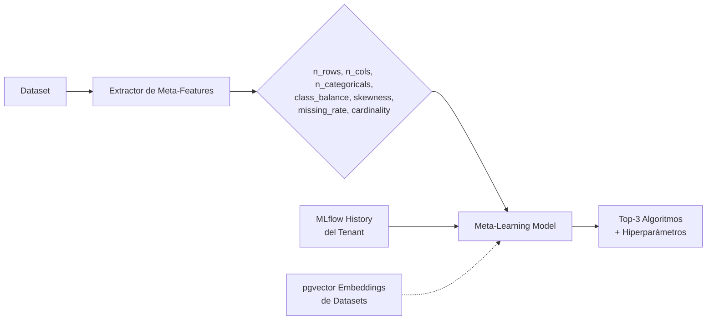

# Fase 3 — Smart Platform: Recommendation Engine & Predictive Analytics

**Timeline:** Q3 2027 (Julio — Septiembre)
**Carácter:** Plataforma proactiva (recomendación, AutoML, monitorización predictiva)
**Dependencias:** Fase 0, Fase 1, Fase 2

> 📖 Documentación de referencia: [roadmap.md](../roadmap.md#fase-3--q3-2027-recommendation-engine--predictive-analytics)

---

## Índice

- [Visión General](#visión-general)
- [Componentes](#componentes)
  - [3.1 Model Recommender](#31-recommendation-engine-para-modelos)
  - [3.2 AutoML Lite](#32-automl-lite)
  - [3.3 Predictive Drift Monitoring](#33-predictive-drift-monitoring)
  - [3.4 Anomaly Detection en Ingesta](#34-anomaly-detection-en-ingesta)
- [Stack Tecnológico](#stack-tecnológico)
- [Impacto en la Arquitectura](#impacto-en-la-arquitectura)
- [API Endpoints](#api-endpoints)
- [Riesgos](#riesgos)
- [Plan de Implementación](#plan-de-implementación)

---

## Visión General

Convertir PraxisML de una herramienta de ML **reactiva** (el usuario pide, la plataforma ejecuta) a una plataforma **proactiva** que sugiere, predice y optimiza automáticamente:

1. **Sistema de Recomendación de Modelos** — Dado un dataset, recomendar el mejor algoritmo, hiperparámetros y pipeline de preprocesamiento.
2. **AutoML Lite** — Entrenamiento automático de N configuraciones y selección del mejor modelo.
3. **Predictive Monitoring** — Predecir cuándo un modelo en producción sufrirá drift, antes de que ocurra.
4. **Anomaly Detection en Ingesta** — Detectar datos anómalos al subir datasets.

Todas estas capacidades se apoyan en la infraestructura de observabilidad de la Fase 0 (métricas históricas, costes, alertas).

---

## Componentes

### 3.1 — Recommendation Engine para Modelos

**Servicio:** `app/services/recommendation_engine.py` — `ModelRecommender`
**Endpoint:** `POST /api/v1/training/recommend`

Dado un dataset, analiza sus meta-features y el historial de entrenamientos del tenant para recomendar los top-3 algoritmos + hiperparámetros.

#### Arquitectura del Recommender



#### Fuentes de Señal

| Señal | Fuente en PraxisML | Peso |
|-------|-------------------|------|
| Meta-features del dataset | `Dataset.num_rows`, `num_columns`, `column_types_analysis` (Fase 1) | 40% |
| Historial del tenant | MLflow experiments con métricas de test | 35% |
| Registry de hiperparámetros | `hyperparams.py` — defaults por algoritmo | 15% |
| Embeddings del dataset | `model_embeddings` tabla pgvector (Fase 1) | 10% |

#### Output

```json
{
  "recommendations": [
    {
      "algorithm": "gradient_boosting",
      "confidence": 0.87,
      "suggested_hyperparams": {
        "n_estimators": 200,
        "max_depth": 5,
        "learning_rate": 0.1
      },
      "reasoning": "Dataset: 15 features numéricas, 0 missing, alta cardinalidad target. Tree-based models excel en este perfil."
    }
  ]
}
```

#### Meta-Features Extraídas

| Feature | Descripción |
|---------|-------------|
| `n_rows` | Número de filas |
| `n_cols` | Número de columnas |
| `n_numeric` | Features numéricas |
| `n_categorical` | Features categóricas |
| `missing_rate` | % de valores nulos global |
| `class_balance` | Ratio minoría/mayoría (clasificación) |
| `skewness_mean` | Asimetría promedio de features numéricas |
| `cardinality_mean` | Cardinalidad promedio de categóricas |
| `target_type` | Binaria / multiclase / continua |

### 3.2 — AutoML Lite

**Celery Task:** `app/worker/tasks/automl.py`

El usuario lanza un "AutoTrain" que automáticamente:

1. Ejecuta el recommender (3.1) para obtener top-5 algoritmos
2. Para cada algoritmo, lanza un entrenamiento via Celery task existente (`SklearnTrainer`)
3. Compara resultados y promueve el mejor modelo a `Staging`

```python
@celery_app.task(bind=True)
def automl_train(self, tenant_id, dataset_id, task_type, target_column):
    recommender = ModelRecommender()
    meta_features = recommender.extract_meta_features(dataset)
    top_algorithms = recommender.recommend(meta_features)

    results = []
    for algo in top_algorithms[:5]:
        trainer = SklearnTrainer(tenant_id)
        result = trainer.train(df, target_column, algo["algorithm"],
                               task_type, algo["hyperparams"])
        results.append(result)

    # Seleccionar mejor por métrica principal
    best = max(results, key=lambda r: r["metrics"].get("f1", r["metrics"].get("r2", 0)))

    # Promover automáticamente a Staging
    mlflow_svc.promote_model(best["mlflow_run_id"], stage="Staging")
    return best
```

**Paralelización:** Los N entrenamientos se lanzan como Celery chord (tareas paralelas + callback de agregación).

#### Endpoint

```
POST /api/v1/training/auto
   → Body: {dataset_id, task_type, target_column, max_trials: 5, optimization_metric: "f1"}
   → Response: {task_id, status_url, estimated_duration_min}
```

### 3.3 — Predictive Drift Monitoring

**Servicio:** `app/services/drift_predictor.py`
**Celery Beat Task:** `app/worker/tasks/drift_monitor.py`

Actualmente el drift se calcula **on-demand**. Esta fase introduce:

#### Componentes

1. **Celery Beat scheduler** — Ejecuta drift checks periódicos cada 6h para modelos en `stage=Production`
2. **Almacenamiento histórico** — Reutiliza tabla `drift_history` de la Fase 0
3. **Modelo predictivo de drift** — ARIMA sobre el historial de PSI/KS para predecir cuándo se superará el umbral
4. **Alertas proactivas** — Reutiliza sistema de alertas de la Fase 0

#### Flujo

```python
@celery_app.task
def scheduled_drift_check():
    production_models = db.query(MLModel).filter(MLModel.stage == "Production").all()
    for model in production_models:
        drift_report = calculate_drift(model)
        store_drift_timeseries(model.id, drift_report)

        forecast = predict_future_drift(model.id)
        if forecast["days_until_critical"] < 7:
            send_drift_alert(model, forecast)
```

#### Endpoints

```
GET  /api/v1/drift/predict/{model_id}   → Predicción de drift futuro (línea de forecast)
GET  /api/v1/drift/summary              → Resumen de estado de drift de todos los modelos
```

### 3.4 — Anomaly Detection en Ingesta

**Post-hook en:** `POST /api/v1/datasets/`

Al subir un dataset, ejecutar Isolation Forest o Autoencoder para detectar filas anómalas.

#### Flujo

1. Usuario sube dataset CSV
2. Post-hook ejecuta `PyOD` (Isolation Forest por defecto) sobre features numéricas
3. Reporta al usuario el % de anomalías detectadas
4. El usuario decide: excluir, investigar, o ignorar

#### Endpoints

```
POST /api/v1/datasets/{id}/detect-anomalies   → Ejecutar detección de anomalías
     → Response: {anomaly_pct, anomalous_rows_count, sample_anomalies: [...]}
```

---

## Stack Tecnológico

| Componente | Tecnología | Justificación |
|-----------|-----------|---------------|
| **Meta-learning** | Custom heurísticas + scikit-learn | Para recomendar algoritmos basado en meta-features. Modelo simple (RandomForest regressor sobre metadatos) |
| **AutoML orchestration** | Celery chords/chains | Reutilizar infraestructura existente de tareas async |
| **Drift forecasting** | `statsforecast` (Nixtla) | Para predicción de drift. Ligero, rápido, integrable |
| **Anomaly detection** | `PyOD` (Python Outlier Detection) | IsolationForest, Autoencoders, LOF — API unificada |
| **Notifications** | Webhooks + Redis pub/sub | Alertas de drift → Slack / email |

---

## Impacto en la Arquitectura

| Cambio | Detalle |
|--------|---------|
| **Celery Beat** | Añadir `celerybeat-schedule` en docker-compose para tareas periódicas |
| **Nuevo servicio** | `app/services/recommendation_engine.py` — ModelRecommender |
| **Nuevo servicio** | `app/services/drift_predictor.py` — Forecasting de drift |
| **Nuevo servicio** | `app/services/anomaly_detector.py` — PyOD wrapper |
| **Nuevo worker** | `app/worker/tasks/drift_monitor.py` — Drift checks periódicos |
| **Nuevo worker** | `app/worker/tasks/automl.py` — AutoML orchestration |
| **Redis pub/sub** | Canal `praxisml:alerts` para notificaciones en tiempo real al frontend |
| **Tablas existentes** | Reutiliza `drift_history` (F0), `alert_config` (F0), `cost_records` (F0) |
| **Frontend** | Drift forecast chart, badge de recomendaciones, panel de anomalías en upload |

---

## API Endpoints

| Método | Path | Descripción |
|--------|------|-------------|
| POST | `/api/v1/training/recommend` | Recomendar algoritmo + hiperparámetros |
| POST | `/api/v1/training/auto` | Lanzar AutoML (entrena N configuraciones) |
| GET | `/api/v1/training/auto/status/{task_id}` | Estado del AutoML |
| GET | `/api/v1/drift/predict/{model_id}` | Predicción de drift futuro |
| GET | `/api/v1/drift/summary` | Resumen de drift de todos los modelos |
| POST | `/api/v1/datasets/{id}/detect-anomalies` | Detectar anomalías en dataset |

---

## Riesgos

| Riesgo | Mitigación |
|--------|-----------|
| **Cold start del recommender** | Sin historial de entrenamientos suficiente, las recomendaciones serán genéricas. Seed con benchmarks públicos (OpenML) |
| **Falsos positivos en anomalías** | Permitir al usuario configurar sensibilidad. Nunca bloquear upload, solo advertir |
| **Carga de Celery Beat** | Drift checks para muchos modelos en producción pueden saturar workers. Limitar a 1 check/modelo/6h y usar concurrency del worker |
| **Privacidad en meta-learning** | Los meta-features son estadísticos (n_rows, variance, etc.), no contienen datos reales → bajo riesgo |
| **AutoML puede ser caro** | Limitar a 5 trials por defecto. Mostrar estimación de coste antes de lanzar |

---

## Plan de Implementación

| Sub-fase | Contenido | Esfuerzo | Dependencias |
|----------|-----------|----------|-------------|
| **3.1a** | `ModelRecommender` — extractor de meta-features + endpoint | 🟡 2-3 sem | Fase 0 (métricas históricas) |
| **3.1b** | Meta-learning model + ranking + feedback loop | 🔴 2-3 sem | 3.1a, MLflow history |
| **3.2** | AutoML Lite — Celery chord + endpoint + promoción automática | 🟡 2 sem | 3.1a |
| **3.3a** | Celery Beat drift scheduler + `drift_predictor` + endpoints | 🟡 2 sem | Fase 0 (drift_history) |
| **3.3b** | Predictive drift model (ARIMA/Prophet) + alertas | 🔴 2 sem | 3.3a, historial de drift |
| **3.4** | Anomaly Detection en ingesta + endpoint | 🟡 1-2 sem | Ninguna |

---

> [← Volver al Roadmap principal](../roadmap.md)
