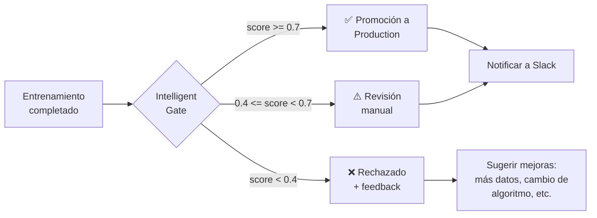

# Fase 4 — AI-Powered DevOps & Platform Intelligence

**Timeline:** Q4 2027 (Octubre — Diciembre)
**Carácter:** Automatización inteligente del ciclo de vida ML + Copilot
**Dependencias:** Fase 0, Fase 1, Fase 2, Fase 3

> 📖 Documentación de referencia: [roadmap.md](../roadmap.md#fase-4--q4-2027-ai-powered-devops--platform-intelligence)

---

## Índice

- [Visión General](#visión-general)
- [Componentes](#componentes)
  - [4.1 AI-Generated Tests](#41-ai-generated-tests)
  - [4.2 Intelligent Model Gate](#42-intelligent-model-gate-cicd)
  - [4.3 Platform Copilot](#43-platform-copilot-agentic-ai)
  - [4.4 Cost & Resource Optimization](#44-cost--resource-optimization)
- [Stack Tecnológico](#stack-tecnológico)
- [Impacto en la Arquitectura](#impacto-en-la-arquitectura)
- [API Endpoints](#api-endpoints)
- [Riesgos](#riesgos)
- [Plan de Implementación](#plan-de-implementación)

---

## Visión General

Cerrar el ciclo de madurez de la plataforma transformando la operación en un sistema **autoregulado**:

1. **AI-Generated Tests** — Generación automática de tests unitarios e integración para nuevos servicios.
2. **Intelligent Model Gate (CI/CD)** — El pipeline de CI decide automáticamente si un modelo puede promocionarse basándose en múltiples señales (métricas, drift, coste, fairness).
3. **Platform Copilot** — Evolución del chatbot (Fase 1) a un agente que ejecuta acciones (entrena modelos, actualiza thresholds, promueve).
4. **Cost & Resource Optimization** — Predicción de costes de inferencia y autoescalado basado en patrones de uso.

---

## Componentes

### 4.1 — AI-Generated Tests

**Punto de entrada:** `ci.yml` + directorio `tests/`

La cobertura actual ha mejorado (Fase 0 de pulido: 60 tests → ~60% coverage), pero áreas como `streaming.py`, `mlflow_service.py`, servicios nuevos de Fases 1-2 carecen de tests.

#### Propuesta

Integrar un agente LLM en el workflow de CI que:

1. Detecta archivos cambiados en el PR
2. Analiza las funciones modificadas (firma, tipos, docstring)
3. Genera tests usando patrones del directorio `tests/` existente como few-shot examples
4. Los tests generados se añaden como sugerencia al PR (no auto-merge)

```yaml
# .github/workflows/ai_tests.yml
name: AI Test Generation
on:
  pull_request:
    paths: ['backend/app/**']

jobs:
  generate-tests:
    runs-on: ubuntu-latest
    steps:
      - uses: actions/checkout@v4
      - name: Generate AI Tests
        uses: custom-action/ai-test-gen@v1
        with:
          model: "gpt-4o"
          context_files: "backend/tests/unit/"
          changed_files: ${{ steps.changed.outputs.files }}
          output: "backend/tests/ai_generated/"
      - name: Create PR Comment
        run: |
          echo "## 🤖 AI-Generated Tests" >> comment.md
          echo "Se han generado tests para los archivos modificados." >> comment.md
          gh pr comment ${{ github.event.pull_request.number }} --body-file comment.md
```

#### Señales de Calidad para Tests Generados

| Señal | Evaluador | Threshold |
|-------|-----------|-----------|
| Cobertura del nuevo código | `pytest --cov` | > 80% de las líneas nuevas |
| Tests no flaky | Ejecución 3x consecutivas | 100% passes |
| Sin mock excesivo | Análisis estático | < 50% de asserts sobre mocks |
| Sigue convenciones del proyecto | Ruff / lint | Pass |

### 4.2 — Intelligent Model Gate (CI/CD)

**Punto de entrada:** `.github/workflows/model_ci.yml`

El workflow actual compara métricas con thresholds estáticos. Expandir a una evaluación **holística**:

```python
# backend/scripts/intelligent_gate.py
def evaluate_model_promotion(run_id: str, target_stage: str) -> Dict:
    """
    Evaluación holística para promoción de modelos.
    Combina: métricas, drift, coste de inferencia, fairness, carbon.
    """
    metrics = mlflow.get_run(run_id).data.metrics
    drift = get_latest_drift(run_id)
    cost = estimate_inference_cost(run_id)

    checks = {
        "performance": metrics.get("test_f1", 0) > 0.85,
        "no_drift": drift.get("psi", 0) < 0.2,
        "latency_ok": metrics.get("test_latency_ms", 999) < 100,
        "fairness": demographic_parity_diff < 0.1,
        "resource_budget": cost["monthly_estimate"] < tenant_budget * 0.1,
        "carbon_budget": metrics.get("carbon_kg", 0) < 10,
    }

    WEIGHTS = {"performance": 0.4, "no_drift": 0.25, "latency_ok": 0.15,
               "fairness": 0.1, "resource_budget": 0.05, "carbon_budget": 0.05}

    score = sum(w * int(v) for w, v in zip(WEIGHTS.values(), checks.values()))
    recommendation = "APPROVE" if score >= 0.7 else "REVIEW" if score >= 0.4 else "REJECT"

    return {"checks": checks, "score": score, "recommendation": recommendation}
```

#### Señales Evaluadas

| Señal | Fuente | Peso |
|-------|--------|------|
| Performance (F1/accuracy) | MLflow metrics | 40% |
| Data drift | Evidently / drift_history | 25% |
| Latencia de inferencia | InferenceService / F0 | 15% |
| Fairness / Bias | `fairlearn` | 10% |
| Coste estimado | CostCalculator (F0) | 5% |
| Huella de carbono | Estimación (F0) | 5% |

#### Flujo CI/CD Mejorado



### 4.3 — Platform Copilot (Agentic AI)

**Evolución del router:** `app/api/routes/v1/nlp/assistant.py` (Fase 1) → `app/services/copilot_service.py`

Usar LangChain Agents con tools que mapean a la API interna de PraxisML:

#### Tools del Copilot

| Tool | Descripción | Seguridad |
|------|-------------|-----------|
| `train_model` | Entrena un modelo ML (dataset_id, algorithm, task_type) | Requiere rol editor |
| `check_drift` | Verifica drift de un modelo en producción | Rol viewer+ |
| `promote_model` | Promueve un modelo a Production o lo archiva | Requiere confirmación |
| `get_predictions` | Obtiene historial de predicciones de un modelo | Rol viewer+ |
| `get_cost_report` | Obtiene resumen de costes del tenant | Rol viewer+ |
| `update_thresholds` | Actualiza umbrales de drift de un modelo | Requiere confirmación |
| `list_models` | Lista modelos del tenant | Rol viewer+ |
| `run_drift_check` | Ejecuta chequeo de drift inmediato | Rol editor |

```python
# app/services/copilot_service.py
from langchain.agents import AgentExecutor, create_tool_calling_agent
from langchain.tools import StructuredTool

tools = [
    StructuredTool.from_function(
        func=train_model,
        name="train_model",
        description="Entrena un modelo ML. Parámetros: dataset_id, algorithm, task_type",
    ),
    StructuredTool.from_function(
        func=check_drift,
        name="check_drift",
        description="Verifica drift de un modelo en producción",
    ),
    StructuredTool.from_function(
        func=promote_model,
        name="promote_model",
        description="Promueve un modelo a Production o lo archiva",
    ),
    StructuredTool.from_function(
        func=get_predictions_history,
        name="get_predictions",
        description="Obtiene el historial de predicciones de un modelo",
    ),
]
```

#### Ejemplos de Conversación

> **Usuario:** "Entrena un RandomForest con el dataset de ventas, si el F1 > 0.9 promuévelo a producción"
> **Copilot:** 
> 1. ✅ Ejecutando `list_models` para encontrar dataset "ventas"
> 2. ✅ Ejecutando `train_model(dataset_id="abc", algorithm="random_forest", task_type="classification")`
> 3. ⏳ Entrenamiento completado. F1 = 0.92. Supera threshold de 0.9.
> 4. ✅ ¿Confirmas la promoción a Production? (requiere confirmación explícita)
> **Usuario:** "Sí, confirma"
> 5. ✅ Modelo promovido a Production. Run ID: 8a3f2c...

#### Seguridad del Copilot

| Principio | Implementación |
|-----------|---------------|
| **Hereda RBAC** | El copilot usa el token JWT del usuario autenticado |
| **Acciones destructivas requieren confirmación** | `promote`, `delete`, `archive`, `update_thresholds` |
| **Audit log** | Todas las acciones se registran en `audit_log` (nueva tabla) |
| **Rate limiting** | El copilot hereda los rate limits del usuario |
| **Presupuesto** | El copilot no puede exceder el budget del tenant |

### 4.4 — Cost & Resource Optimization

**Punto de entrada:** Prometheus métricas (Fase 0) + Grafana dashboards

#### Componentes

1. **Modelo de forecasting de carga** — ARIMA sobre métricas de Prometheus para predecir picos de inferencia
2. **Autoescalado de workers** — Si `celery_queue_size > threshold` por más de 5 min, lanzar worker adicional via Docker API
3. **Recomendación de optimización de costes** — Identificar modelos que pueden beneficiarse de ONNX export, caching, o batch inference
4. **Dashboard de eficiencia** — "Predicciones por dólar", "GPU utilization por entrenamiento"

#### Alertas de Optimización

| Alerta | Trigger | Acción sugerida |
|--------|---------|----------------|
| **GPU infrautilizada** | gpu_util < 20% por > 1h durante training | Aumentar batch size |
| **Cache ineficiente** | cache_hit < 5% | Revisar TTL, aumentar variedad de inputs |
| **Modelo zombie** | Modelo Production sin inferencias en 7d | Archivar o eliminar |
| **Coste por inferencia alto** | cost_per_inference > 2x promedio plataforma | Exportar a ONNX, reducir tamaño del modelo |
| **Sobreaprovisionamiento** | worker_utilization < 30% por > 24h | Reducir concurrency de workers |

---

## Stack Tecnológico

| Componente | Tecnología | Justificación |
|-----------|-----------|---------------|
| **Agentic AI** | LangChain Agents + LangGraph | Framework estándar para agentes con tools. LangGraph para flujos multi-step |
| **AI Test Generation** | OpenAI API / Claude + `pytest` templates | Generar tests usando LLM contextualizado con el codebase |
| **Fairness / Bias** | `fairlearn` (Microsoft) | Métricas de fairness integradas en el gate de promoción |
| **Cost Estimation** | CostCalculator (Fase 0) + modelo de tendencias | Estimar coste mensual por modelo/tenant |
| **Audit Log** | Nueva tabla PostgreSQL `audit_log` | Trazabilidad de acciones del copilot |

---

## Impacto en la Arquitectura

| Cambio | Detalle |
|--------|---------|
| **Nueva tabla** | `audit_log(id, tenant_id, user_id, action, params jsonb, result jsonb, timestamp, source)` — source: `user` / `copilot` / `ci` |
| **Nuevo servicio** | `app/services/copilot_service.py` — LangChain Agent con tools PraxisML |
| **Nuevo servicio** | `app/services/resource_optimizer.py` — Forecasting de carga + recomendaciones |
| **Extensión CI/CD** | Nuevo workflow `ai_tests.yml` + script `intelligent_gate.py` |
| **Nuevo middleware** | Interceptor de requests del copilot para audit log |
| **Frontend** | Chat widget en Sidebar con historial. Botón "approve/reject" para acciones del copilot |
| **Grafana** | Dashboard de eficiencia: predicciones/$, GPU utilization, cost trend |

---

## API Endpoints

| Método | Path | Descripción |
|--------|------|-------------|
| POST | `/api/v1/copilot/chat` | Enviar mensaje al copilot |
| GET | `/api/v1/copilot/history` | Historial de conversaciones |
| DELETE | `/api/v1/copilot/history` | Borrar historial |
| POST | `/api/v1/copilot/confirm/{action_id}` | Confirmar acción pendiente |
| GET | `/api/v1/optimization/recommendations` | Recomendaciones de optimización |
| GET | `/api/v1/optimization/efficiency` | Dashboard de eficiencia (datos agregados) |

---

## Riesgos

| Riesgo | Mitigación |
|--------|-----------|
| **Copilot ejecuta acciones no deseadas** | Confirmación explícita para `promote`, `delete`, `archive`. Logging exhaustivo en `audit_log` |
| **Coste de LLM para generación de tests** | Limitar generación a PRs que tocan archivos críticos (services, core_ml). Cache de tests generados |
| **Hallucinations del LLM** | Los tools del copilot validan inputs internamente. Si el LLM pide "entrenar con algoritmo inexistente", el tool falla gracefulmente |
| **Adoption del equipo** | El copilot es opt-in. No reemplaza la UX existente, la complementa |
| **Falsos positivos en Intelligent Gate** | El gate nunca bloquea emergencias. Umbrales configurables por tenant |
| **Privacidad en generación de tests** | El LLM solo recibe firmas de funciones y docstrings, no datos de producción |

---

## Plan de Implementación

| Sub-fase | Contenido | Esfuerzo | Dependencias |
|----------|-----------|----------|-------------|
| **4.1a** | AI test generation workflow + prompt engineering | 🟡 2 sem | GitHub Actions |
| **4.1b** | Evaluación de calidad de tests generados + auto-PR | 🟡 1-2 sem | 4.1a |
| **4.2a** | `intelligent_gate.py` — evaluación holística + score | 🟡 2 sem | F3 (recommender), F0 (cost, drift) |
| **4.2b** | Integración en model_ci.yml + dashboard de decisiones | 🟡 1 sem | 4.2a |
| **4.3a** | Copilot agent + tools + seguridad + audit log | 🔴 3-4 sem | F1 (assistant base), F0 (cost) |
| **4.3b** | Frontend chat widget + confirmación UX | 🔴 2-3 sem | 4.3a |
| **4.4a** | Forecasting de carga + autoescalado de workers | 🟡 2 sem | F0 (métricas Prometheus) |
| **4.4b** | Dashboard de eficiencia + recomendaciones de optimización | 🟡 1-2 sem | 4.4a |

---

> [← Volver al Roadmap principal](../roadmap.md)
